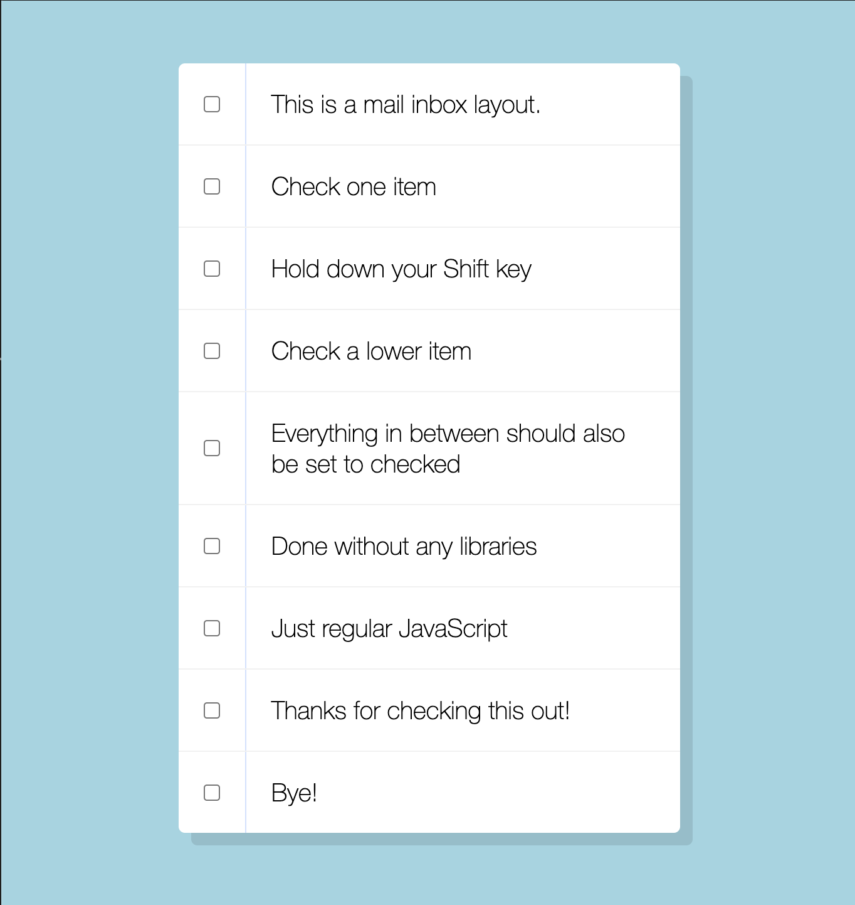

# Mail Inbox Checkboxes



A simple and intuitive UI component that mimics the behavior of an email inbox where users can select multiple checkboxes using the **Shift key**. Built with **vanilla JavaScript**, HTML, and CSS, this project allows users to check multiple items efficiently, just like in real mail applications.

## Key Features
- **Shift + Click Selection**: Select multiple checkboxes between two clicked points with the Shift key.
- **Minimalist Design**: Clean and modern UI for a smooth user experience.
- **No Libraries Needed**: Implemented purely with vanilla JavaScript.
- **Lightweight & Fast**: Optimized for quick interactions and minimal performance impact.

## Technologies Used
- **Frontend**: HTML, CSS with  modern styling.
- **JavaScript**: Handles the Shift + Click multi-selection logic.

## How to Run
1. Clone the repository:
   ```bash
   git clone https://github.com/yourusername/Mail-Inbox-Checkboxes.git
   cd Mail-Inbox-Checkboxes
   ```
2. Open `index.html` in your browser to interact with the checkboxes.

## Live Demo
Check out the [Live Demo here](https://chrisroland.github.io/Mail-Inbox-Checkboxes/)

## Contributions
- Feel free to **open issues** for any bugs or feature suggestions.
- **Pull requests** are welcome for enhancements or new features.
- This project is **open-sourced**, and I appreciate **constructive feedback** and **collaborations**!

## Future Enhancements
- Add a "Select All" checkbox option.
- Implement a dark mode toggle for better accessibility.
- Allow deselecting checkboxes with Shift + Click.
- Integrate with an actual email system or task manager.

Thank you for exploring this project! ❤️